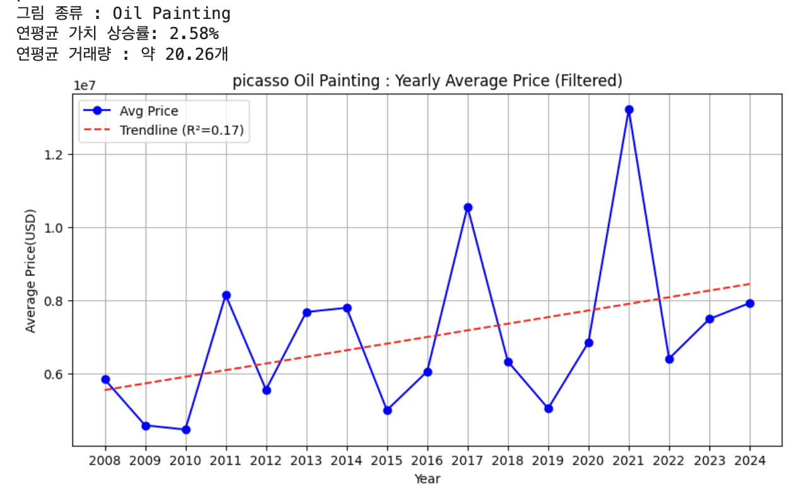
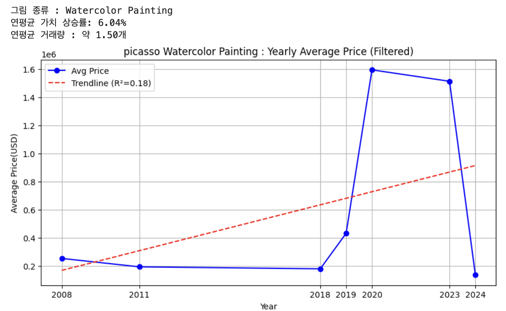
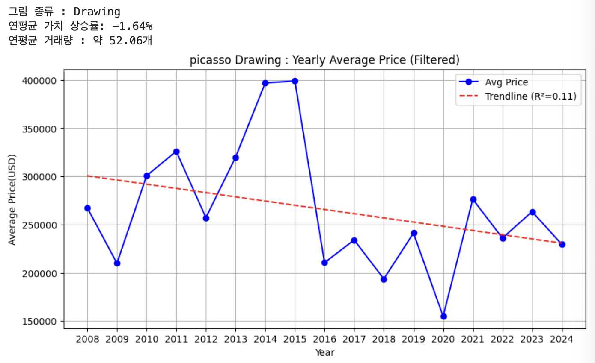
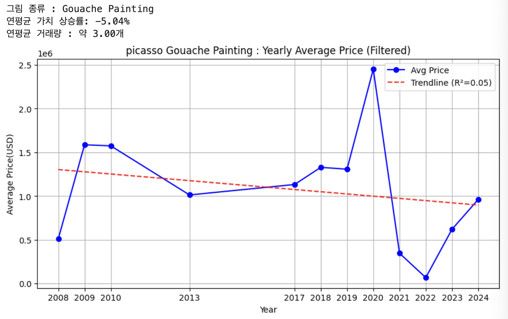
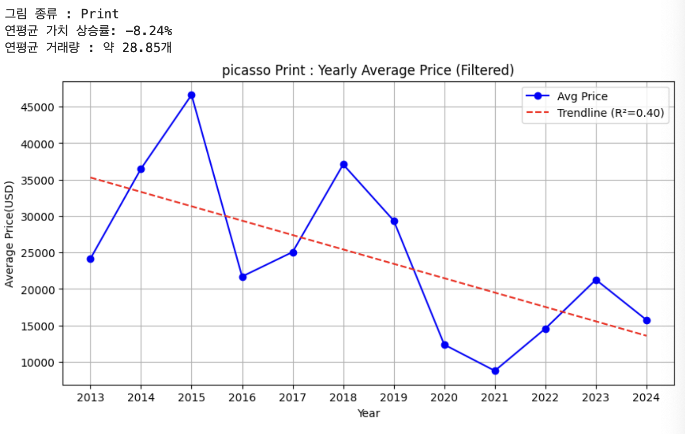
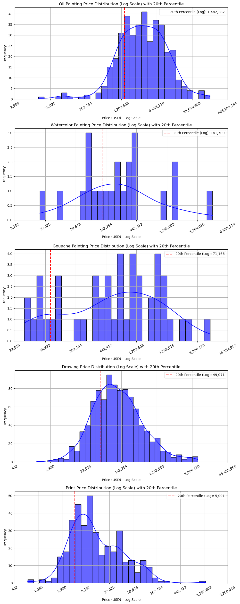

# 예술작품 투자 분석 서비스
예술작품에 대한 경매데이터를 보고, 각종 투자지표 분석한 데이터 엔지니어링 서비스입니다. 

## Artist : Pablo Picasso
## 작품 상승률
- 작품 종류별 예상 연평균 수익률 입니다.
    1. Oil Painting : 약 2.58%
    2. Watercolor Painting : 약 6.04%
    3. Drawing : 약 -1.64%
    4. Gouache Painting : 약 -5.04%
    5. Print : 약 -8.24%
    

## 최소 예상 투자 액수

- 작품 분야 별 가격 하위 20%의 최대값 계산
  - 작품들의 80%는 이 값과 같거나 크다
  - 이 작가의 작품을 사려면 최소 이 정도 비용을 준비해놓는 것이 좋다. 
  - 미니멈 예상 투자 액수 추정 - 작가 자체를 알아볼 시간을 단축

- 최소 예상 투자 액수 계산, 액수 순으로 내림차순 정렬한 결과
  1. Oil Painting: 1,442,282
  2. Watercolor Painting: 141,700
  3. Gouache Painting: 71,166
  4. Drawing: 49,071
  5. Print: 5,091

## 환금성 분야 순위
- 예상가를 더 잘 상회하는 작품은 수요가 많아 환금성이 높은 작품입니다.
  1. Print
  2. Drawing
  3. Watercolor Painting
  4. Gouache Painting
  5. Oil Painting

### Drawing:

### Watercolor Painting:

### Oil Painting:

### Gouache Painting:

### Print:

